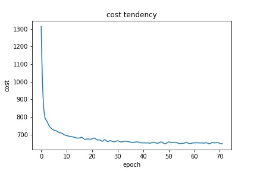
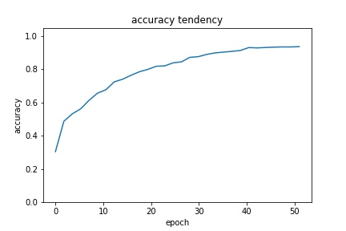
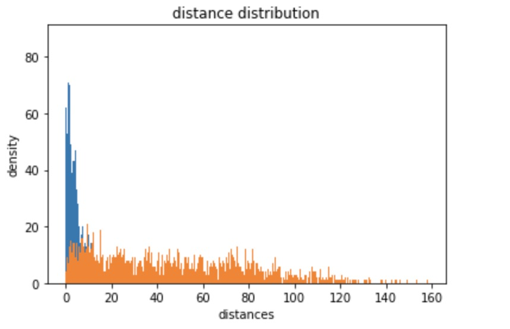
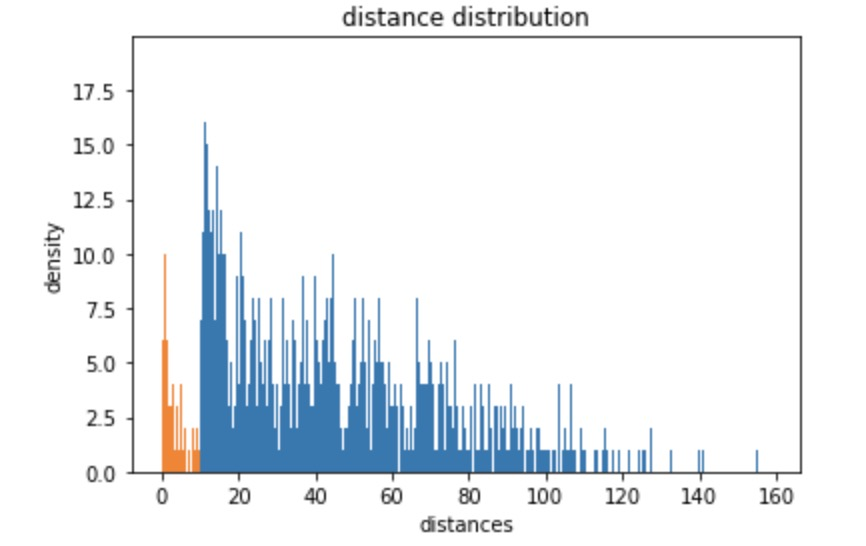

# Face Verification with Siamese Network-Contrastive Loss in TensorFlow

## Requirements

We recommend using python3 and a virtual environment:

```
python3
tensorflow-gpu == 1.3.0 (CUDA 8.0)
matplotlib == 3.0.2
numpy = 1.14.5
skimage
```

+ `main.py`: Train Siamese network
+ `util.py`: General function for the whole program (eg reading data and data shuffling)
+ `test.py`: Test the model performance on the test set
+ `predict.y`: Evaluating the model performance on the  validation set
+ `Siamese.py`: Python class for Siamese network implementing with VGG-16 and Contrastive Loss
+ `data_random`: Shuffling data on the training/validation set and generating positive/negative pairs of equal number for training

## Training on CASIA-WebFace

We use the general human face data set `CASIA-WebFace-Align-96` for training. So file path needs modifying before everying ready for training. And it should be noted that original image size should be **112\*96\*3**. And function in script `util.py` will rescale them to **96\*96\*3** to fit the newwork input.

For training, simply run:

```python
python main.py
```

After the program is done, it will save the **trained model** in directory `./model`, with **coss_list.txt,accuracy_list.txt and distance.txt** file in the current directory. 

+ coss_list.txt: training cost for each epoch
+ accuracy_list.txt: training accuracy on the training set for each epoch
+ distance.txt: average distance of positive pairs and negative pairs on the training set

## Evaluating on LFW

Same things should be done just as the training process.  When everything is ready. Simply run:

```:1st_place_medal:
python predict.py
```

When the program completes, it will generate files **predict_accuracy.txt, predict_distance.txt, predict_margin_distance.txt** in the current directory.

+ predict_accuracy: evaluating accuracy for each epoch
+ predict_distance: average distance of positive pairs and negative pairs on the validation set
+ predict_margin_distance: previously I assumed margin distance will be helpful for decision making, but l found I was run later, so this file is in insignificance

## Testing Model Performance

Same things should be done as training and evaluating process. When everything is ready. 6000 pairs of faces are used for testing with equal number of positive and negative pairs. For testing, simply run:

```:1st_place_medal:
python test.py
```

When the program completes, it will generates files **result.csv, distances.csv and ambiguouty.csv** in the current directory.

+ result.csv: labels for testing, 1 for postive prediction and 0 for negative prediction
+ distances.csv: distances attribution in the embedding space for the testing set
+ ambiguouty.csv: "ambiguouty" means Paris lying near the decision margin

## Training Results

Loss tendancy:



Accuracy tendancy:



## Evaluation Results

We random shuffle the evaluation set for postive pairs and negative pairs of equal number for evaluation and finally get 84.6% accuracy for verification.

It should be note that if a similar task like classification is implented the performance may be better on the evaluation set while we implent a somewhat different evaluation task.

Distance distribution of positive/negative paris in the embedding space: 

<center>
    
</center>

## Tesing Results

Distance distribution of positive/negative paris in the embedding space: 

<center>
    
</center>


## Resources

[Triplet loss in TensorFlow](https://github.com/omoindrot/tensorflow-triplet-loss)

[Siamese_tf_mnist](https://github.com/ywpkwon/siamese_tf_mnist)

> 1. S. Chopra, R. Hadsell, and Y. LeCun. Learning a similarity metric discriminatively, with application to face verification. In 2005 IEEE Computer Society Conference on Computer Vision and Pattern Recognition (CVPR’05), volume 1, pages 539–546 vol. 1, June 2005. 
> 2. K. He, X. Zhang, S. Ren, and J. Sun. Deep residual learning for image recognition. CoRR, abs/1512.03385, 2015. 
> 3. A. Hermans, L. Beyer, and B. Leibe. In defense of the triplet loss for person re- identification. CoRR, abs/1703.07737, 2017. 
> 4. O. Moindrot. Triplet loss and online triplet mining in tensorflow, Oct. 2018. 
> 5. F. Schroff, D. Kalenichenko, and J. Philbin. Facenet: A unified embedding for face recognition and clustering. In The IEEE Conference on Computer Vision and Pattern Recognition (CVPR), June 2015. 